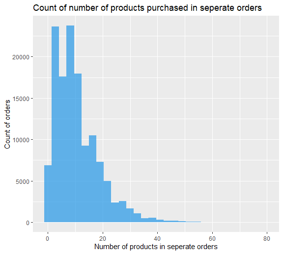
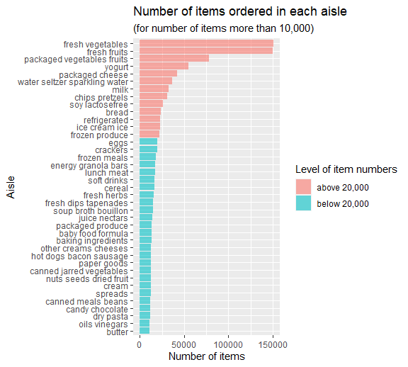
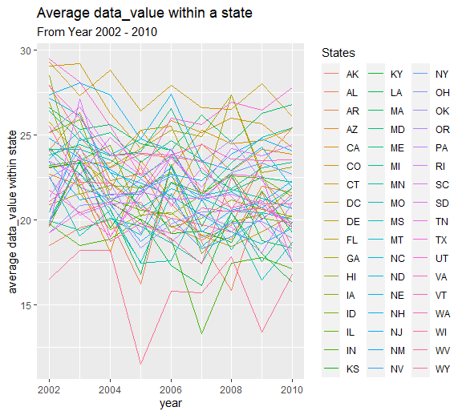
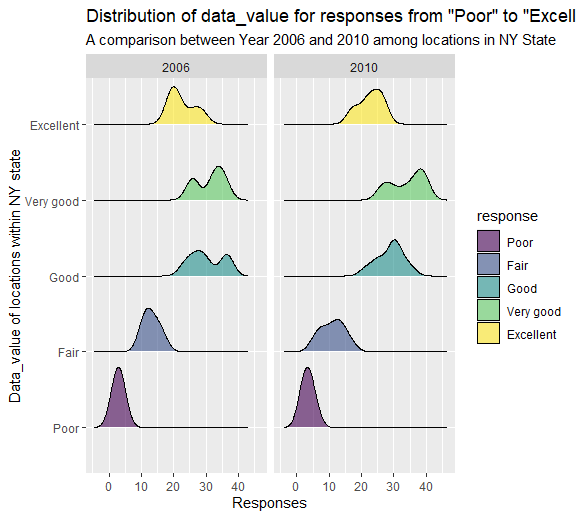
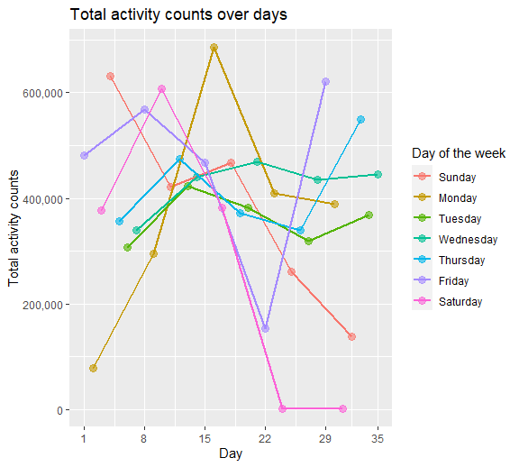
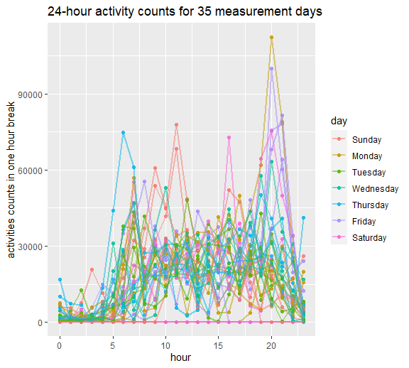

P8105 Homework 3
================
Mengfan Luo (ml4701)

### Problem 1

Let’s load the `instacart` data and view the first 10 lines of it:

``` r
data("instacart")
knitr::kable(head(instacart,10))
```

| order\_id | product\_id | add\_to\_cart\_order | reordered | user\_id | eval\_set | order\_number | order\_dow | order\_hour\_of\_day | days\_since\_prior\_order | product\_name                                 | aisle\_id | department\_id | aisle                         | department   |
|----------:|------------:|---------------------:|----------:|---------:|:----------|--------------:|-----------:|---------------------:|--------------------------:|:----------------------------------------------|----------:|---------------:|:------------------------------|:-------------|
|         1 |       49302 |                    1 |         1 |   112108 | train     |             4 |          4 |                   10 |                         9 | Bulgarian Yogurt                              |       120 |             16 | yogurt                        | dairy eggs   |
|         1 |       11109 |                    2 |         1 |   112108 | train     |             4 |          4 |                   10 |                         9 | Organic 4% Milk Fat Whole Milk Cottage Cheese |       108 |             16 | other creams cheeses          | dairy eggs   |
|         1 |       10246 |                    3 |         0 |   112108 | train     |             4 |          4 |                   10 |                         9 | Organic Celery Hearts                         |        83 |              4 | fresh vegetables              | produce      |
|         1 |       49683 |                    4 |         0 |   112108 | train     |             4 |          4 |                   10 |                         9 | Cucumber Kirby                                |        83 |              4 | fresh vegetables              | produce      |
|         1 |       43633 |                    5 |         1 |   112108 | train     |             4 |          4 |                   10 |                         9 | Lightly Smoked Sardines in Olive Oil          |        95 |             15 | canned meat seafood           | canned goods |
|         1 |       13176 |                    6 |         0 |   112108 | train     |             4 |          4 |                   10 |                         9 | Bag of Organic Bananas                        |        24 |              4 | fresh fruits                  | produce      |
|         1 |       47209 |                    7 |         0 |   112108 | train     |             4 |          4 |                   10 |                         9 | Organic Hass Avocado                          |        24 |              4 | fresh fruits                  | produce      |
|         1 |       22035 |                    8 |         1 |   112108 | train     |             4 |          4 |                   10 |                         9 | Organic Whole String Cheese                   |        21 |             16 | packaged cheese               | dairy eggs   |
|        36 |       39612 |                    1 |         0 |    79431 | train     |            23 |          6 |                   18 |                        30 | Grated Pecorino Romano Cheese                 |         2 |             16 | specialty cheeses             | dairy eggs   |
|        36 |       19660 |                    2 |         1 |    79431 | train     |            23 |          6 |                   18 |                        30 | Spring Water                                  |       115 |              7 | water seltzer sparkling water | beverages    |

#### EDA

The `intacart` dataset has 1384617 rows and 15 columns. There’s 0
missing value.

The 15 variables include 4 character variables and 11 numeric variables,
which are:

**numeric variables:**

-   `order_id`: despite consist of numbers, this should be an character
    variable given it’s a series number used for identifying different
    orders, rather then have any quantitative information. There are
    131209 distinct values of `order_id`.

Some other numeric variable here have the issues, including:

-   `product_id`: 39123 distinct values.
-   `add_to_cart_order`: 80 distinct values.
-   `reordered`: 2 distinct values.
-   `user_id`: 131209 distinct values.
-   `aisle_id`: 134 distinct values.
-   `department_id`: 21 distinct values.

Other “true” numeric variables are:

-   `order_number`: numeric variable with mean 17.0914101 and range \[4,
    100\].
-   `days_since_prior_order`: numeric variable with mean 17.0661259 and
    range \[0, 30\].
-   `order_dow`: numeric (integer) variable with mean 2.7013918 and
    range \[0, 6\], which stands for Sunday to Saturday.
-   `order_hour_of_day`: numeric (integer) variable with mean 13.5775922
    and range \[0, 23\], which stands for certain hours in a day.

**character variables:**

-   `eval_set`: 1 distinct value. This variable may not be so crucial
    since it only has 1 unique value `train`.
-   `product_name`: 39123 distinct values.
-   `aisle`: 134 distinct values.
-   `department`: 21 distinct values.

Some variables have a one-to-one mapping relationship, including

-   `product_id` and `product_name`
-   `aisle_id` and `aisle`
-   `department_id` and `department`

and each pair has exact number of unique values.

``` r
names(instacart)
```

    ##  [1] "order_id"               "product_id"             "add_to_cart_order"     
    ##  [4] "reordered"              "user_id"                "eval_set"              
    ##  [7] "order_number"           "order_dow"              "order_hour_of_day"     
    ## [10] "days_since_prior_order" "product_name"           "aisle_id"              
    ## [13] "department_id"          "aisle"                  "department"

``` r
tibble(
  var = c("product_id", "product_name", 
          "aisle_id", "aisle" , 
          "department_id" , "department"),
  unique_var = c(n_distinct(pull(instacart,product_id)),
                 n_distinct(pull(instacart,product_name)),
                 n_distinct(pull(instacart,aisle_id)),
                 n_distinct(pull(instacart,aisle)),
                 n_distinct(pull(instacart,department_id)),
                 n_distinct(pull(instacart,department)))
) %>% knitr::kable()
```

| var            | unique\_var |
|:---------------|------------:|
| product\_id    |       39123 |
| product\_name  |       39123 |
| aisle\_id      |         134 |
| aisle          |         134 |
| department\_id |          21 |
| department     |          21 |

Besides, we can also see number of unique `order_id` is equal to that of
`user_id`, both are 131209. This means in this dataset, only one order
is included for each unique user.

``` r
instacart %>% 
  group_by(user_id) %>% 
  summarize(distinct_order = n_distinct(order_id)) %>% 
  arrange(distinct_order)
```

    ## # A tibble: 131,209 x 2
    ##    user_id distinct_order
    ##      <int>          <int>
    ##  1       1              1
    ##  2       2              1
    ##  3       5              1
    ##  4       7              1
    ##  5       8              1
    ##  6       9              1
    ##  7      10              1
    ##  8      13              1
    ##  9      14              1
    ## 10      17              1
    ## # ... with 131,199 more rows

For each order, we can summarize some important features and plots as
followed.

``` r
inst_order = instacart %>% 
  group_by(order_id) %>% 
  mutate(
    n_product = n_distinct(product_id)
    ) %>%
  select(order_id,order_number,order_dow,order_hour_of_day,n_product) %>% 
  distinct() %>% 
  relocate(order_id,n_product) 

knitr::kable(head(inst_order,10))
```

| order\_id | n\_product | order\_number | order\_dow | order\_hour\_of\_day |
|----------:|-----------:|--------------:|-----------:|---------------------:|
|         1 |          8 |             4 |          4 |                   10 |
|        36 |          8 |            23 |          6 |                   18 |
|        38 |          9 |             6 |          6 |                   16 |
|        96 |          7 |             7 |          6 |                   20 |
|        98 |         49 |            41 |          3 |                    8 |
|       112 |         11 |             5 |          5 |                   14 |
|       170 |         17 |             7 |          0 |                   13 |
|       218 |          5 |            12 |          0 |                   21 |
|       226 |         13 |             4 |          0 |                   12 |
|       349 |         11 |             9 |          3 |                   16 |

``` r
min(pull(inst_order,n_product))
## [1] 1
max(pull(inst_order,n_product))
## [1] 80
mean(pull(inst_order,n_product))
## [1] 10.55276
```

We can find that the minimum number of product bought is 1, maximum is
80, and average number is about 11. The number of products in seperate
orders can be visualized as the following bar plot.

``` r
inst_order %>% 
  ggplot(aes(x=n_product))+ geom_histogram(fill = "4",alpha = .7)+
  labs(
    title = "Count of number of products purchased in seperate orders",
    x = "Number of products in seperate orders",
    y = "Count of orders"
  )
```

    ## `stat_bin()` using `bins = 30`. Pick better value with `binwidth`.



#### Questions

**1. How many aisles are there, and which aisles are the most items
ordered from?**

``` r
n_distinct(pull(instacart,aisle))
```

    ## [1] 134

``` r
instacart %>% 
  group_by(aisle) %>% 
  summarize(n_items = n()) %>% 
  arrange(by = desc(n_items))
```

    ## # A tibble: 134 x 2
    ##    aisle                         n_items
    ##    <chr>                           <int>
    ##  1 fresh vegetables               150609
    ##  2 fresh fruits                   150473
    ##  3 packaged vegetables fruits      78493
    ##  4 yogurt                          55240
    ##  5 packaged cheese                 41699
    ##  6 water seltzer sparkling water   36617
    ##  7 milk                            32644
    ##  8 chips pretzels                  31269
    ##  9 soy lactosefree                 26240
    ## 10 bread                           23635
    ## # ... with 124 more rows

From the above results, there are 134 aisles, and the top 2 aisles that
have most items ordered from are `fresh vegetables` and `fresh fruits`.

**2. Make a plot that shows the number of items ordered in each aisle,
limiting this to aisles with more than 10000 items ordered. Arrange
aisles sensibly, and organize your plot so others can read it.**

``` r
instacart %>% 
  group_by(aisle) %>% 
  summarize(n_items = n()) %>% 
  filter(n_items > 10000) %>% 
  mutate(aisle = fct_reorder(aisle,n_items),
         n_level = case_when(n_items < 20000 ~ "below 20,000",
                           n_items > 20000 ~ "above 20,000")
         ) %>% 
  ggplot(aes(x = aisle, y = n_items,fill = n_level))+
  geom_bar(stat = "identity",alpha = .6)+
  coord_flip() +
  labs(
    title = "Number of items ordered in each aisle",
    subtitle = "(for number of items more than 10,000)",
    x = "Aisle",
    y = "Number of items",
    fill = "Level of item numbers"
  )
```



**3. Make a table showing the three most popular items in each of the
aisles “baking ingredients”, “dog food care”, and “packaged vegetables
fruits”. Include the number of times each item is ordered in your
table.**

``` r
instacart %>% 
  select(aisle,product_name) %>% 
  filter(aisle == "baking ingredients" | aisle == "dog food care" | aisle == "packaged vegetables fruits") %>% 
  group_by(product_name) %>% 
  mutate(n_product = n())%>% 
  distinct() %>% 
  group_by(aisle) %>% 
  mutate(rank_within_aisle = min_rank(desc(n_product))) %>% 
  filter(rank_within_aisle == 1|rank_within_aisle ==2 | rank_within_aisle ==3) %>% 
  arrange(aisle,rank_within_aisle) %>% 
  knitr::kable()
```

| aisle                      | product\_name                                 | n\_product | rank\_within\_aisle |
|:---------------------------|:----------------------------------------------|-----------:|--------------------:|
| baking ingredients         | Light Brown Sugar                             |        499 |                   1 |
| baking ingredients         | Pure Baking Soda                              |        387 |                   2 |
| baking ingredients         | Cane Sugar                                    |        336 |                   3 |
| dog food care              | Snack Sticks Chicken & Rice Recipe Dog Treats |         30 |                   1 |
| dog food care              | Organix Chicken & Brown Rice Recipe           |         28 |                   2 |
| dog food care              | Small Dog Biscuits                            |         26 |                   3 |
| packaged vegetables fruits | Organic Baby Spinach                          |       9784 |                   1 |
| packaged vegetables fruits | Organic Raspberries                           |       5546 |                   2 |
| packaged vegetables fruits | Organic Blueberries                           |       4966 |                   3 |

The above table shows the three most popular items in each of the aisles
“baking ingredients”, “dog food care”, and “packaged vegetables fruits”.
The number of times each item is ordered are presented in column
`n_product`

**4. Make a table showing the mean hour of the day at which Pink Lady
Apples and Coffee Ice Cream are ordered on each day of the week; format
this table for human readers (i.e. produce a 2 x 7 table).**

``` r
hour_week = instacart %>% 
  select(product_name, order_dow,order_hour_of_day) %>% 
  filter(product_name == "Pink Lady Apples" | product_name == "Coffee Ice Cream") %>% 
  group_by(product_name,order_dow) %>% 
  mutate(mean_hour = round(mean(order_hour_of_day))) %>% 
  select(-order_hour_of_day) %>% 
  distinct() %>% 
  pivot_wider(names_from = order_dow,values_from = mean_hour,names_sort = TRUE)
colnames(hour_week) = c("Products/Days","Sun","Mon","Tue","Wed","Thu","Fri","Sat")
  
knitr::kable(hour_week)
```

| Products/Days    | Sun | Mon | Tue | Wed | Thu | Fri | Sat |
|:-----------------|----:|----:|----:|----:|----:|----:|----:|
| Pink Lady Apples |  13 |  11 |  12 |  14 |  12 |  13 |  12 |
| Coffee Ice Cream |  14 |  14 |  15 |  15 |  15 |  12 |  14 |

The above 2\*7 table shows the mean hour of the day at which
`Pink Lady Apples` and `Coffee Ice Cream` are ordered from Sun to Sat.

### Problem 2

#### Data Loading and Cleaning

``` r
data("brfss_smart2010")

brfss = brfss_smart2010 %>% 
  janitor::clean_names() %>% 
  filter(topic == "Overall Health",
         response %in% c('Excellent','Very good','Good','Fair','Poor'))%>%
  mutate(
    response = factor(response,order = TRUE, 
        levels = c('Poor','Fair','Good','Very good','Excellent'))
    ) 
sum(is.na(brfss))
## [1] 31847
brfss = brfss %>% 
  select(-data_value_footnote_symbol,-data_value_footnote,-location_id)


sum(is.na(brfss))
## [1] 28
```

After cleaning the columns names and filtering “Overall Health” and
selected response levels, there are 31847 `NA` values, mostly in columns
`data_value_footnote_symbol`,`data_value_footnote` and `location_id`.
Since these columns are null or only have one kind of input, we drop the
3 columns for simplicity. After that, there only has 28 missing values,
all line in `data_value`, which are kept temporarily until some analysis
on this feature in later analysis.

First 10 lines of the processes dataset is shown below:

``` r
knitr::kable(head(brfss,10))
```

| year | locationabbr | locationdesc          | class         | topic          | question                    | response  | sample\_size | data\_value | confidence\_limit\_low | confidence\_limit\_high | display\_order | data\_value\_unit | data\_value\_type | data\_source | class\_id | topic\_id | question\_id | respid  | geo\_location           |
|-----:|:-------------|:----------------------|:--------------|:---------------|:----------------------------|:----------|-------------:|------------:|-----------------------:|------------------------:|---------------:|:------------------|:------------------|:-------------|:----------|:----------|:-------------|:--------|:------------------------|
| 2010 | AL           | AL - Jefferson County | Health Status | Overall Health | How is your general health? | Excellent |           94 |        18.9 |                   14.1 |                    23.6 |              1 | %                 | Crude Prevalence  | BRFSS        | CLASS08   | Topic41   | GENHLTH      | RESP056 | (33.518601, -86.814688) |
| 2010 | AL           | AL - Jefferson County | Health Status | Overall Health | How is your general health? | Very good |          148 |        30.0 |                   24.9 |                    35.0 |              2 | %                 | Crude Prevalence  | BRFSS        | CLASS08   | Topic41   | GENHLTH      | RESP057 | (33.518601, -86.814688) |
| 2010 | AL           | AL - Jefferson County | Health Status | Overall Health | How is your general health? | Good      |          208 |        33.1 |                   28.2 |                    38.0 |              3 | %                 | Crude Prevalence  | BRFSS        | CLASS08   | Topic41   | GENHLTH      | RESP058 | (33.518601, -86.814688) |
| 2010 | AL           | AL - Jefferson County | Health Status | Overall Health | How is your general health? | Fair      |          107 |        12.5 |                    9.5 |                    15.4 |              4 | %                 | Crude Prevalence  | BRFSS        | CLASS08   | Topic41   | GENHLTH      | RESP059 | (33.518601, -86.814688) |
| 2010 | AL           | AL - Jefferson County | Health Status | Overall Health | How is your general health? | Poor      |           45 |         5.5 |                    3.5 |                     7.4 |              5 | %                 | Crude Prevalence  | BRFSS        | CLASS08   | Topic41   | GENHLTH      | RESP060 | (33.518601, -86.814688) |
| 2010 | AL           | AL - Mobile County    | Health Status | Overall Health | How is your general health? | Excellent |           91 |        15.6 |                   11.0 |                    20.1 |              1 | %                 | Crude Prevalence  | BRFSS        | CLASS08   | Topic41   | GENHLTH      | RESP056 | (30.683993, -88.170637) |
| 2010 | AL           | AL - Mobile County    | Health Status | Overall Health | How is your general health? | Very good |          177 |        31.3 |                   26.0 |                    36.5 |              2 | %                 | Crude Prevalence  | BRFSS        | CLASS08   | Topic41   | GENHLTH      | RESP057 | (30.683993, -88.170637) |
| 2010 | AL           | AL - Mobile County    | Health Status | Overall Health | How is your general health? | Good      |          224 |        31.2 |                   26.1 |                    36.2 |              3 | %                 | Crude Prevalence  | BRFSS        | CLASS08   | Topic41   | GENHLTH      | RESP058 | (30.683993, -88.170637) |
| 2010 | AL           | AL - Mobile County    | Health Status | Overall Health | How is your general health? | Fair      |          120 |        15.5 |                   11.7 |                    19.2 |              4 | %                 | Crude Prevalence  | BRFSS        | CLASS08   | Topic41   | GENHLTH      | RESP059 | (30.683993, -88.170637) |
| 2010 | AL           | AL - Mobile County    | Health Status | Overall Health | How is your general health? | Poor      |           66 |         6.4 |                    4.4 |                     8.3 |              5 | %                 | Crude Prevalence  | BRFSS        | CLASS08   | Topic41   | GENHLTH      | RESP060 | (30.683993, -88.170637) |

#### Questions

**1. In 2002, which states were observed at 7 or more locations? What
about in 2010?**

``` r
states_2002 = brfss %>% 
  filter(year == 2002) %>% 
  group_by(locationabbr) %>% 
  summarize(year = 2002,
            n_location = n_distinct(locationdesc)) %>% 
  filter(n_location >= 7)
knitr::kable(states_2002)
```

| locationabbr | year | n\_location |
|:-------------|-----:|------------:|
| CT           | 2002 |           7 |
| FL           | 2002 |           7 |
| MA           | 2002 |           8 |
| NC           | 2002 |           7 |
| NJ           | 2002 |           8 |
| PA           | 2002 |          10 |

``` r
states_2010 = brfss %>% 
  filter(year == 2010) %>% 
  group_by(locationabbr) %>% 
  summarize(year = 2010,
            n_location = n_distinct(locationdesc)) %>% 
  filter(n_location >= 7)
knitr::kable(states_2010)
```

| locationabbr | year | n\_location |
|:-------------|-----:|------------:|
| CA           | 2010 |          12 |
| CO           | 2010 |           7 |
| FL           | 2010 |          41 |
| MA           | 2010 |           9 |
| MD           | 2010 |          12 |
| NC           | 2010 |          12 |
| NE           | 2010 |          10 |
| NJ           | 2010 |          19 |
| NY           | 2010 |           9 |
| OH           | 2010 |           8 |
| PA           | 2010 |           7 |
| SC           | 2010 |           7 |
| TX           | 2010 |          16 |
| WA           | 2010 |          10 |

In 2002, states including `CT, FL, MA, NC, NJ, PA` were observed at 7 or
more locations; In 2010, states including
`CA, CO, FL, MA, MD, NC, NE, NJ, NY, OH, PA, SC, TX, WA` were observed
at 7 or more locations.

**2. Construct a dataset that is limited to Excellent responses, and
contains, year, state, and a variable that averages the data\_value
across locations within a state. Make a “spaghetti” plot of this average
value over time within a state (that is, make a plot showing a line for
each state across years – the geom\_line geometry and group aesthetic
will help).**

We construct the required dataset as `excl_df`. `NA` values are omitted
when calculating mean value of `data_value`. A preview of 10 lines was
shown below.

``` r
excl_df = brfss %>% 
  filter(response == "Excellent") %>% 
  select(year, locationabbr,data_value) %>% 
  group_by(locationabbr,year) %>% 
  mutate(mean_data_value = mean(data_value,na.rm = TRUE)) %>% 
  select(-data_value) %>% 
  distinct()

knitr::kable(head(excl_df,10))
```

| year | locationabbr | mean\_data\_value |
|-----:|:-------------|------------------:|
| 2010 | AL           |          18.43333 |
| 2010 | AZ           |          21.60000 |
| 2010 | AR           |          25.40000 |
| 2010 | CA           |          23.87500 |
| 2010 | CO           |          25.38571 |
| 2010 | CT           |          24.24000 |
| 2010 | DE           |          20.30000 |
| 2010 | DC           |          26.10000 |
| 2010 | FL           |          19.56923 |
| 2010 | GA           |          23.10000 |

A “spaghetti” plot the average value over year within a state is shown
below.

``` r
excl_df %>% 
  ggplot(aes(x = year, y = mean_data_value, group = locationabbr, color = locationabbr)) +
  geom_line(size = .7)+
  labs(
    title = "Average data_value within a state",
    subtitle = "From Year 2002 - 2010",
    y = "average data_value within state",
    color = "States"
  )
```



**3. Make a two-panel plot showing, for the years 2006, and 2010,
distribution of data\_value for responses (“Poor” to “Excellent”) among
locations in NY State.**

The following violin plot shows the differences in distribution of
`data_value` for `response`s ‘Poor’,‘Fair’,‘Good’,‘Very
good’,‘Excellent’ between 2006 and 2010 among locations in NY State.

``` r
brfss %>% 
  filter(year == 2006 | year == 2010,
         locationabbr == "NY") %>% 
  select(year,response,data_value) %>% 
  ggplot(aes( x = data_value,y = response, fill = response))+
  geom_density_ridges(alpha = .6,scale = 0.8) +
  #geom_dist(aes(fill = response))+
  facet_grid(.~year)+
  labs(
    title = "Distribution of data_value for responses from \"Poor\" to \"Excellent\"",
    subtitle = "A comparison between Year 2006 and 2010 among locations in NY State",
    x = "Responses",
    y = "Data_value of locations within NY state"
  )
```

    ## Picking joint bandwidth of 2.1

    ## Picking joint bandwidth of 2.03



### Problem 3

#### Loading and tidying data

``` r
accel_df = read_csv("data/accel_data.csv") %>%
  janitor::clean_names() %>% 
  mutate(
    weekend = ifelse(day %in% c("Saturday","Sunday"),1,0),
         day = factor(day,levels = c("Sunday","Monday","Tuesday","Wednesday","Thursday","Friday","Saturday"))
    ) %>% 
  pivot_longer(4:1443,names_to = "minute", names_prefix = "activity_",values_to = "activity_count") %>% 
  mutate(
    weekend = as.factor(weekend),
    minute = as.numeric(minute)
    ) 
```

    ## Rows: 35 Columns: 1443

    ## -- Column specification --------------------------------------------------------
    ## Delimiter: ","
    ## chr    (1): day
    ## dbl (1442): week, day_id, activity.1, activity.2, activity.3, activity.4, ac...

    ## 
    ## i Use `spec()` to retrieve the full column specification for this data.
    ## i Specify the column types or set `show_col_types = FALSE` to quiet this message.

#### 1.

After data wrangling, the resulting dataframe has 50400 observations and
6 variables. The variables include:

-   `week`: numeric variable from the original data, contains 5 integers
    from 1 to 5.
-   `day_id`: numeric variable from the original data, contains 35
    integers from 1 to 35.
-   `day`: `day` character variable containing 7 unique values Sunday,
    Monday, Tuesday, Wednesday, Thursday, Friday, Saturday from the
    original data, here converted to factor variable.
-   `weekend`: a newly created factor variable containing factors `1`
    and `0`, where `1` stands for weekend, and `0` stands for weekdays.
-   `minute`: a newly created numeric variable by `pivot_longer` of the
    original variable `activity.*`. It stands for the minute when the
    activity occurs.
-   `activity_count`: another newly created numeric variable by
    `pivot_longer` of the original variable `activity.*`. It contains
    the original activity counts for each minute.

An overview of first 10 lines of the resulting dataset is shown below:

``` r
knitr::kable(head(accel_df,10))
```

| week | day\_id | day    | weekend | minute | activity\_count |
|-----:|--------:|:-------|:--------|-------:|----------------:|
|    1 |       1 | Friday | 0       |      1 |        88.37778 |
|    1 |       1 | Friday | 0       |      2 |        82.24444 |
|    1 |       1 | Friday | 0       |      3 |        64.44444 |
|    1 |       1 | Friday | 0       |      4 |        70.04444 |
|    1 |       1 | Friday | 0       |      5 |        75.04444 |
|    1 |       1 | Friday | 0       |      6 |        66.26667 |
|    1 |       1 | Friday | 0       |      7 |        53.75556 |
|    1 |       1 | Friday | 0       |      8 |        47.84444 |
|    1 |       1 | Friday | 0       |      9 |        55.46667 |
|    1 |       1 | Friday | 0       |     10 |        42.95556 |

#### 2.

The following table presents the total activity counts calculated from
the `accel_df` dataset over days. Also, a scatter plot is generated to
help observe whether there’s a trend line under the data.

``` r
accel_df %>% 
  group_by(day_id,day) %>% 
  summarize(total_activity_count = sum(activity_count)) %>% 
  knitr::kable()
```

    ## `summarise()` has grouped output by 'day_id'. You can override using the `.groups` argument.

| day\_id | day       | total\_activity\_count |
|--------:|:----------|-----------------------:|
|       1 | Friday    |              480542.62 |
|       2 | Monday    |               78828.07 |
|       3 | Saturday  |              376254.00 |
|       4 | Sunday    |              631105.00 |
|       5 | Thursday  |              355923.64 |
|       6 | Tuesday   |              307094.24 |
|       7 | Wednesday |              340115.01 |
|       8 | Friday    |              568839.00 |
|       9 | Monday    |              295431.00 |
|      10 | Saturday  |              607175.00 |
|      11 | Sunday    |              422018.00 |
|      12 | Thursday  |              474048.00 |
|      13 | Tuesday   |              423245.00 |
|      14 | Wednesday |              440962.00 |
|      15 | Friday    |              467420.00 |
|      16 | Monday    |              685910.00 |
|      17 | Saturday  |              382928.00 |
|      18 | Sunday    |              467052.00 |
|      19 | Thursday  |              371230.00 |
|      20 | Tuesday   |              381507.00 |
|      21 | Wednesday |              468869.00 |
|      22 | Friday    |              154049.00 |
|      23 | Monday    |              409450.00 |
|      24 | Saturday  |                1440.00 |
|      25 | Sunday    |              260617.00 |
|      26 | Thursday  |              340291.00 |
|      27 | Tuesday   |              319568.00 |
|      28 | Wednesday |              434460.00 |
|      29 | Friday    |              620860.00 |
|      30 | Monday    |              389080.00 |
|      31 | Saturday  |                1440.00 |
|      32 | Sunday    |              138421.00 |
|      33 | Thursday  |              549658.00 |
|      34 | Tuesday   |              367824.00 |
|      35 | Wednesday |              445366.00 |

``` r
accel_df %>% 
  group_by(day_id,day) %>% 
  summarize(total_activity_count = sum(activity_count)) %>%
  ggplot(aes(x = day_id, y = total_activity_count,color = day))+
  geom_point(size = 3,alpha = .6)+
  geom_line(aes(group = day),size = .8)+
  labs(
    title = "Total activity counts over days",
    x = "Day",
    y = "Total activity counts",
    color = "Day of the week"
  )+ scale_x_continuous(
    breaks = c(1,8,15,22,29,35),
    labels = c(1,8,15,22,29,35)
  )+ scale_y_continuous(
    breaks = c(0,200000,400000,600000),
    labels = c(0,'200,000','400,000','600,000')
  )
```

    ## `summarise()` has grouped output by 'day_id'. You can override using the `.groups` argument.



From both the table and plot, total activity counts does not seem have
apparent trends.

#### 3.

Accelerometer data allows the inspection activity over the course of the
day. Make a single-panel plot that shows the 24-hour activity time
courses for each day and use color to indicate day of the week. Describe
in words any patterns or conclusions you can make based on this graph.

To generate the 24-hour activity time courses for each day, convert
minute to hours by taking the integer part of `minute/60`. For
`minute = 14400`, categorize it into `hour = 0`. The following plot
shows the 24-hour activity time courses for each day. Each line
represents activity variation for one day in different hours, and
different colors represent for day of the week.

``` r
accel_df %>% 
  mutate(hour_0_24 = floor(minute/60),
         hour = ifelse(hour_0_24 == 24, 0, hour_0_24)) %>% 
  group_by(hour,day_id,day) %>%
  summarize(activity_count_hour = sum(activity_count)) %>%
  ggplot(aes(x = hour, y = activity_count_hour,group = day_id,color = day))+
  geom_point(alpha = .8)+
  geom_line(alpha = .5,size = .8)+labs(
    title = "24-hour activity counts for 35 measurement days",
    y = "activities counts in one hour break"
  )
```

    ## `summarise()` has grouped output by 'hour', 'day_id'. You can override using the `.groups` argument.



From the plot, we can see that in most days, activity accounts are less
during the night from 22pm to 6am, and are more in the rest hour
intervals, which quite make sense considering the real life routine of a
person. But there’s no clear pattern regarding activity counts in
different days of week.
