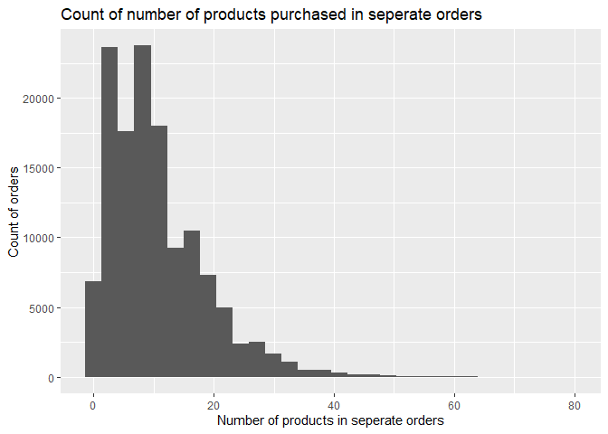
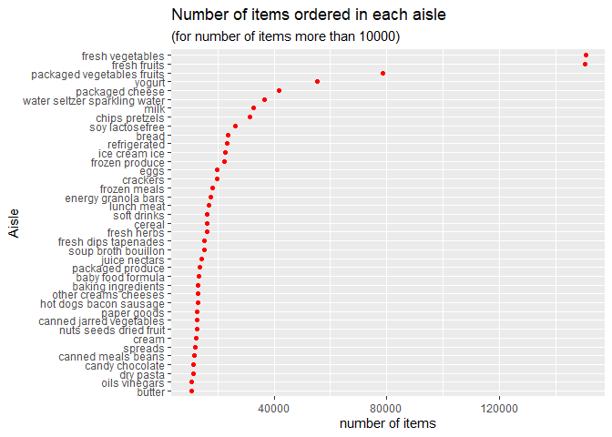

P8105 Homework 3
================
Mengfan Luo (ml4701)

### Problem 1

Let’s load the `instacart` data and view the first 10 lines of it:

``` r
data("instacart")
knitr::kable(head(instacart,15))
```

| order\_id | product\_id | add\_to\_cart\_order | reordered | user\_id | eval\_set | order\_number | order\_dow | order\_hour\_of\_day | days\_since\_prior\_order | product\_name                                 | aisle\_id | department\_id | aisle                         | department   |
|----------:|------------:|---------------------:|----------:|---------:|:----------|--------------:|-----------:|---------------------:|--------------------------:|:----------------------------------------------|----------:|---------------:|:------------------------------|:-------------|
|         1 |       49302 |                    1 |         1 |   112108 | train     |             4 |          4 |                   10 |                         9 | Bulgarian Yogurt                              |       120 |             16 | yogurt                        | dairy eggs   |
|         1 |       11109 |                    2 |         1 |   112108 | train     |             4 |          4 |                   10 |                         9 | Organic 4% Milk Fat Whole Milk Cottage Cheese |       108 |             16 | other creams cheeses          | dairy eggs   |
|         1 |       10246 |                    3 |         0 |   112108 | train     |             4 |          4 |                   10 |                         9 | Organic Celery Hearts                         |        83 |              4 | fresh vegetables              | produce      |
|         1 |       49683 |                    4 |         0 |   112108 | train     |             4 |          4 |                   10 |                         9 | Cucumber Kirby                                |        83 |              4 | fresh vegetables              | produce      |
|         1 |       43633 |                    5 |         1 |   112108 | train     |             4 |          4 |                   10 |                         9 | Lightly Smoked Sardines in Olive Oil          |        95 |             15 | canned meat seafood           | canned goods |
|         1 |       13176 |                    6 |         0 |   112108 | train     |             4 |          4 |                   10 |                         9 | Bag of Organic Bananas                        |        24 |              4 | fresh fruits                  | produce      |
|         1 |       47209 |                    7 |         0 |   112108 | train     |             4 |          4 |                   10 |                         9 | Organic Hass Avocado                          |        24 |              4 | fresh fruits                  | produce      |
|         1 |       22035 |                    8 |         1 |   112108 | train     |             4 |          4 |                   10 |                         9 | Organic Whole String Cheese                   |        21 |             16 | packaged cheese               | dairy eggs   |
|        36 |       39612 |                    1 |         0 |    79431 | train     |            23 |          6 |                   18 |                        30 | Grated Pecorino Romano Cheese                 |         2 |             16 | specialty cheeses             | dairy eggs   |
|        36 |       19660 |                    2 |         1 |    79431 | train     |            23 |          6 |                   18 |                        30 | Spring Water                                  |       115 |              7 | water seltzer sparkling water | beverages    |
|        36 |       49235 |                    3 |         0 |    79431 | train     |            23 |          6 |                   18 |                        30 | Organic Half & Half                           |        53 |             16 | cream                         | dairy eggs   |
|        36 |       43086 |                    4 |         1 |    79431 | train     |            23 |          6 |                   18 |                        30 | Super Greens Salad                            |       123 |              4 | packaged vegetables fruits    | produce      |
|        36 |       46620 |                    5 |         1 |    79431 | train     |            23 |          6 |                   18 |                        30 | Cage Free Extra Large Grade AA Eggs           |        86 |             16 | eggs                          | dairy eggs   |
|        36 |       34497 |                    6 |         1 |    79431 | train     |            23 |          6 |                   18 |                        30 | Prosciutto, Americano                         |        96 |             20 | lunch meat                    | deli         |
|        36 |       48679 |                    7 |         1 |    79431 | train     |            23 |          6 |                   18 |                        30 | Organic Garnet Sweet Potato (Yam)             |        83 |              4 | fresh vegetables              | produce      |

``` r
skimr::skim(instacart)
# Results is for my reference and is not shown in the report
colnames_inst = colnames(instacart)
```

#### EDA

The `intacart` dataset has 1384617 rows and 15 columns. There’s 0
missing value.

The 15 variables include 4 character variables and 11 numeric variables,
which are:

**numeric variables:**

-   `order_id`: despite consist of numbers, this should be an character
    variable given it’s a series number used for identifying different
    orders, rather then have any quantitative information. There are
    131209 distinct values of `order_id`.

Some other numeric variable here have the issues, in cluding:

-   `product_id`: 39123 distinct values.
-   `add_to_cart_order`: 80 distinct values.
-   `reordered`: 2 distinct values.
-   `user_id`: 131209 distinct values.
-   `order_dow`: 7 distinct values.
-   `order_hour_of_day`: 24 distinct values.
-   `aisle_id`: 134 distinct values.
-   `department_id`: 21 distinct values.

Other “true” numeric variables are:

-   `order_number`: numeric variable with mean 17.0914101 and range \[4,
    100\].
-   `days_since_prior_order`: numeric variable with mean 17.0661259 and
    range \[0, 30\].

**character variables:**

-   `eval_set`: 1 distinct value. This variable may not be so crucial
    since it only has 1 unique value `train`.
-   `product_name`: 39123 distinct values.
-   `aisle`: 134 distinct values.
-   `department`: 21 distinct values.

Some variables have a one-to-one mapping relationship, including

-   `product_id` and `product_name`
-   `aisle_id` and `aisle`
-   `department_id` and `department`

and each pair has exact number of unique values.

``` r
names(instacart)
```

    ##  [1] "order_id"               "product_id"             "add_to_cart_order"     
    ##  [4] "reordered"              "user_id"                "eval_set"              
    ##  [7] "order_number"           "order_dow"              "order_hour_of_day"     
    ## [10] "days_since_prior_order" "product_name"           "aisle_id"              
    ## [13] "department_id"          "aisle"                  "department"

``` r
tibble(
  var = c("product_id", "product_name", 
          "aisle_id", "aisle" , 
          "department_id" , "department"),
  unique_var = c(n_distinct(pull(instacart,product_id)),
                 n_distinct(pull(instacart,product_name)),
                 n_distinct(pull(instacart,aisle_id)),
                 n_distinct(pull(instacart,aisle)),
                 n_distinct(pull(instacart,department_id)),
                 n_distinct(pull(instacart,department)))
) %>% knitr::kable()
```

| var            | unique\_var |
|:---------------|------------:|
| product\_id    |       39123 |
| product\_name  |       39123 |
| aisle\_id      |         134 |
| aisle          |         134 |
| department\_id |          21 |
| department     |          21 |

Besides, we can also see number of unique `order_id` is equal to that of
`user_id`, both are 131209. This means in this dataset, only one order
is included for each unique user.

``` r
instacart %>% 
  group_by(user_id) %>% 
  summarize(distinct_order = n_distinct(order_id)) %>% 
  arrange(distinct_order)
```

    ## # A tibble: 131,209 x 2
    ##    user_id distinct_order
    ##      <int>          <int>
    ##  1       1              1
    ##  2       2              1
    ##  3       5              1
    ##  4       7              1
    ##  5       8              1
    ##  6       9              1
    ##  7      10              1
    ##  8      13              1
    ##  9      14              1
    ## 10      17              1
    ## # ... with 131,199 more rows

For each order, we can summarize some important features and plots as
followed.

``` r
inst_order = instacart %>% 
  group_by(order_id) %>% 
  mutate(
    n_product = n_distinct(product_id)
    ) %>%
  select(order_id,order_number,order_dow,order_hour_of_day,n_product) %>% 
  distinct() %>% 
  relocate(order_id,n_product) 

knitr::kable(head(inst_order,10))
```

| order\_id | n\_product | order\_number | order\_dow | order\_hour\_of\_day |
|----------:|-----------:|--------------:|-----------:|---------------------:|
|         1 |          8 |             4 |          4 |                   10 |
|        36 |          8 |            23 |          6 |                   18 |
|        38 |          9 |             6 |          6 |                   16 |
|        96 |          7 |             7 |          6 |                   20 |
|        98 |         49 |            41 |          3 |                    8 |
|       112 |         11 |             5 |          5 |                   14 |
|       170 |         17 |             7 |          0 |                   13 |
|       218 |          5 |            12 |          0 |                   21 |
|       226 |         13 |             4 |          0 |                   12 |
|       349 |         11 |             9 |          3 |                   16 |

``` r
min(pull(inst_order,n_product))
```

    ## [1] 1

``` r
max(pull(inst_order,n_product))
```

    ## [1] 80

``` r
mean(pull(inst_order,n_product))
```

    ## [1] 10.55276

We can find that the minimum number of product bought is 1, maximum is
80, and average number is about 11. The number of products in seperate
orders can be visualized as the following bar plot.

``` r
inst_order %>% 
  ggplot(aes(x=n_product))+ geom_histogram()+
  labs(
    title = "Count of number of products purchased in seperate orders",
    x = "Number of products in seperate orders",
    y = "Count of orders"
  )
```

    ## `stat_bin()` using `bins = 30`. Pick better value with `binwidth`.

<!-- -->

#### Questions

**1. How many aisles are there, and which aisles are the most items
ordered from?**

``` r
n_distinct(pull(instacart,aisle))
```

    ## [1] 134

``` r
instacart %>% 
  group_by(aisle) %>% 
  summarize(n_items = n()) %>% 
  arrange(by = desc(n_items))
```

    ## # A tibble: 134 x 2
    ##    aisle                         n_items
    ##    <chr>                           <int>
    ##  1 fresh vegetables               150609
    ##  2 fresh fruits                   150473
    ##  3 packaged vegetables fruits      78493
    ##  4 yogurt                          55240
    ##  5 packaged cheese                 41699
    ##  6 water seltzer sparkling water   36617
    ##  7 milk                            32644
    ##  8 chips pretzels                  31269
    ##  9 soy lactosefree                 26240
    ## 10 bread                           23635
    ## # ... with 124 more rows

From the above results, there are 134 aisles, and the top 2 aisles that
have most items ordered from are `fresh vegetables` and `fresh fruits`.

**2. Make a plot that shows the number of items ordered in each aisle,
limiting this to aisles with more than 10000 items ordered. Arrange
aisles sensibly, and organize your plot so others can read it.**

``` r
instacart %>% 
  group_by(aisle) %>% 
  summarize(n_items = n()) %>% 
  filter(n_items > 10000) %>% 
  mutate(aisle = fct_reorder(aisle,n_items),
         ) %>% 
  ggplot(aes(x = n_items, y = aisle))+
  geom_point(color = "red")+
  labs(
    title = "Number of items ordered in each aisle",
    subtitle = "(for number of items more than 10000)",
    x = "number of items",
    y = "Aisle"
  )
```

<!-- -->

**3. Make a table showing the three most popular items in each of the
aisles “baking ingredients”, “dog food care”, and “packaged vegetables
fruits”. Include the number of times each item is ordered in your
table.**

``` r
instacart %>% 
  select(aisle,product_name) %>% 
  filter(aisle == "baking ingredients" | aisle == "dog food care" | aisle == "packaged vegetables fruits") %>% 
  group_by(product_name) %>% 
  mutate(n_product = n())%>% 
  distinct() %>% 
  group_by(aisle) %>% 
  mutate(rank = min_rank(desc(n_product))) %>% 
  filter(rank == 1|rank ==2 | rank ==3) %>% 
  arrange(aisle,rank) %>% 
  knitr::kable()
```

| aisle                      | product\_name                                 | n\_product | rank |
|:---------------------------|:----------------------------------------------|-----------:|-----:|
| baking ingredients         | Light Brown Sugar                             |        499 |    1 |
| baking ingredients         | Pure Baking Soda                              |        387 |    2 |
| baking ingredients         | Cane Sugar                                    |        336 |    3 |
| dog food care              | Snack Sticks Chicken & Rice Recipe Dog Treats |         30 |    1 |
| dog food care              | Organix Chicken & Brown Rice Recipe           |         28 |    2 |
| dog food care              | Small Dog Biscuits                            |         26 |    3 |
| packaged vegetables fruits | Organic Baby Spinach                          |       9784 |    1 |
| packaged vegetables fruits | Organic Raspberries                           |       5546 |    2 |
| packaged vegetables fruits | Organic Blueberries                           |       4966 |    3 |

The above table showsthe three most popular items in each of the aisles
“baking ingredients”, “dog food care”, and “packaged vegetables fruits”.
The number of times each item is ordered are presented in column
`n_product`

**4. Make a table showing the mean hour of the day at which Pink Lady
Apples and Coffee Ice Cream are ordered on each day of the week; format
this table for human readers (i.e. produce a 2 x 7 table).**

``` r
hour_week = instacart %>% 
  select(product_name, order_dow,order_hour_of_day) %>% 
  filter(product_name == "Pink Lady Apples" | product_name == "Coffee Ice Cream") %>% 
  group_by(product_name,order_dow) %>% 
  mutate(mean_hour = mean(order_hour_of_day)) %>% 
  select(-order_hour_of_day) %>% 
  distinct() %>% 
  pivot_wider(names_from = order_dow,values_from = mean_hour,names_sort = TRUE)
colnames(hour_week) = c("Products/Days","Sun","Mon","Tue","Wed","Thu","Fri","Sat")
  
knitr::kable(hour_week)
```

| Products/Days    |      Sun |      Mon |      Tue |      Wed |      Thu |      Fri |      Sat |
|:-----------------|---------:|---------:|---------:|---------:|---------:|---------:|---------:|
| Pink Lady Apples | 13.44118 | 11.36000 | 11.70213 | 14.25000 | 11.55172 | 12.78431 | 11.93750 |
| Coffee Ice Cream | 13.77419 | 14.31579 | 15.38095 | 15.31818 | 15.21739 | 12.26316 | 13.83333 |

The above 2\*7 table shows the mean hour of the day at which
`Pink Lady Apples` and `Coffee Ice Cream` are ordered from Sun to Sat.
